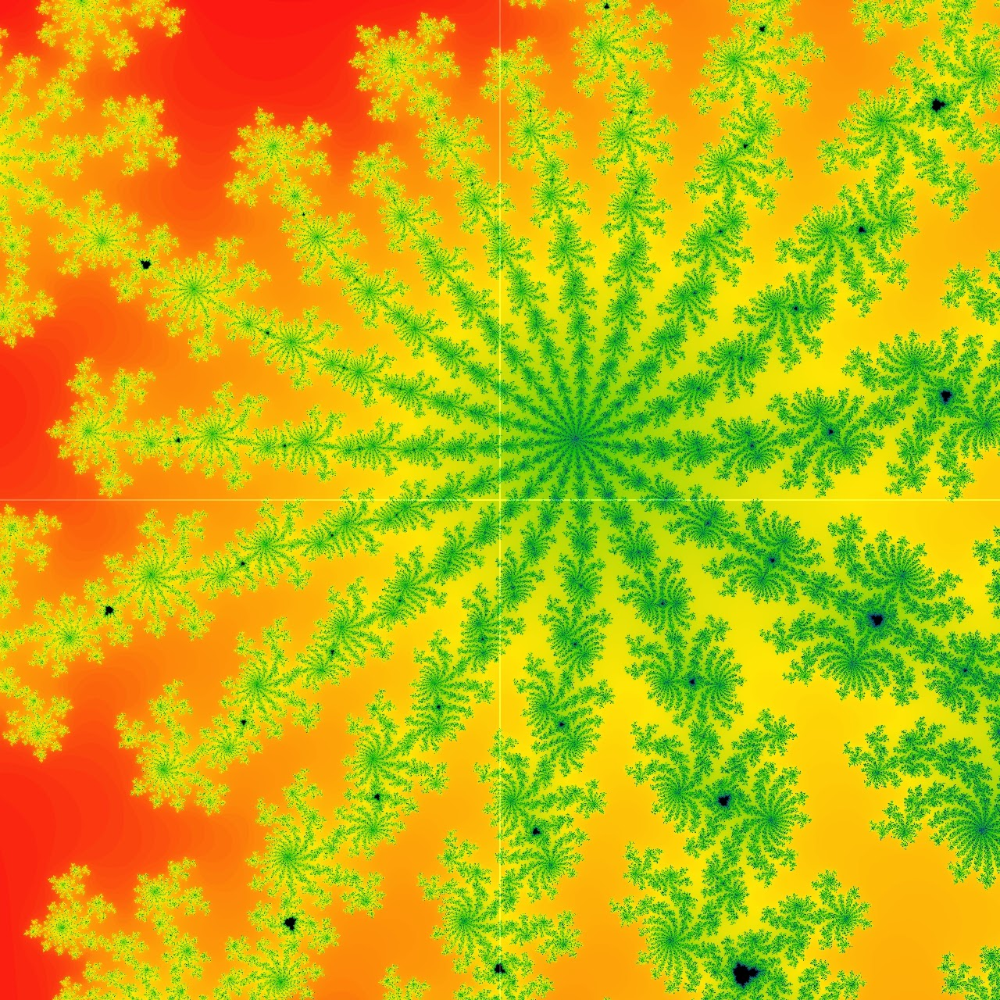
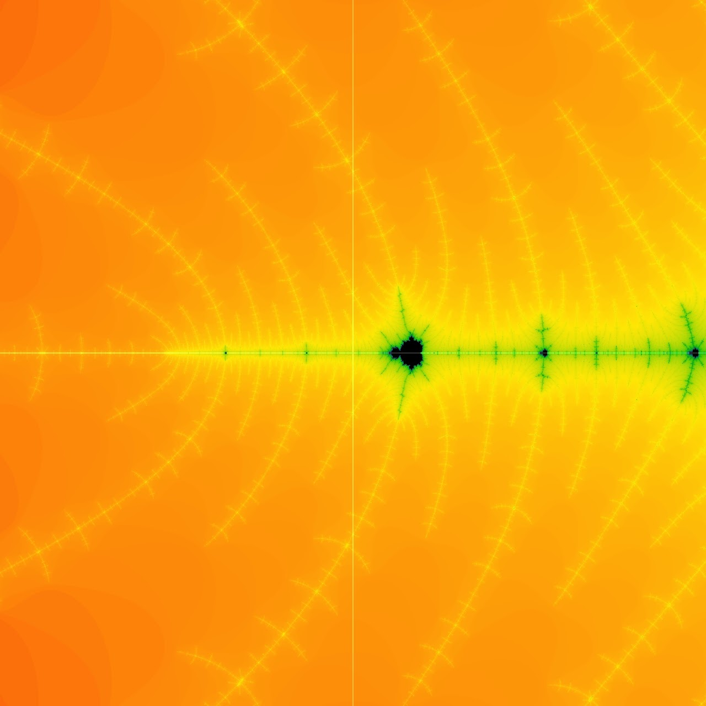
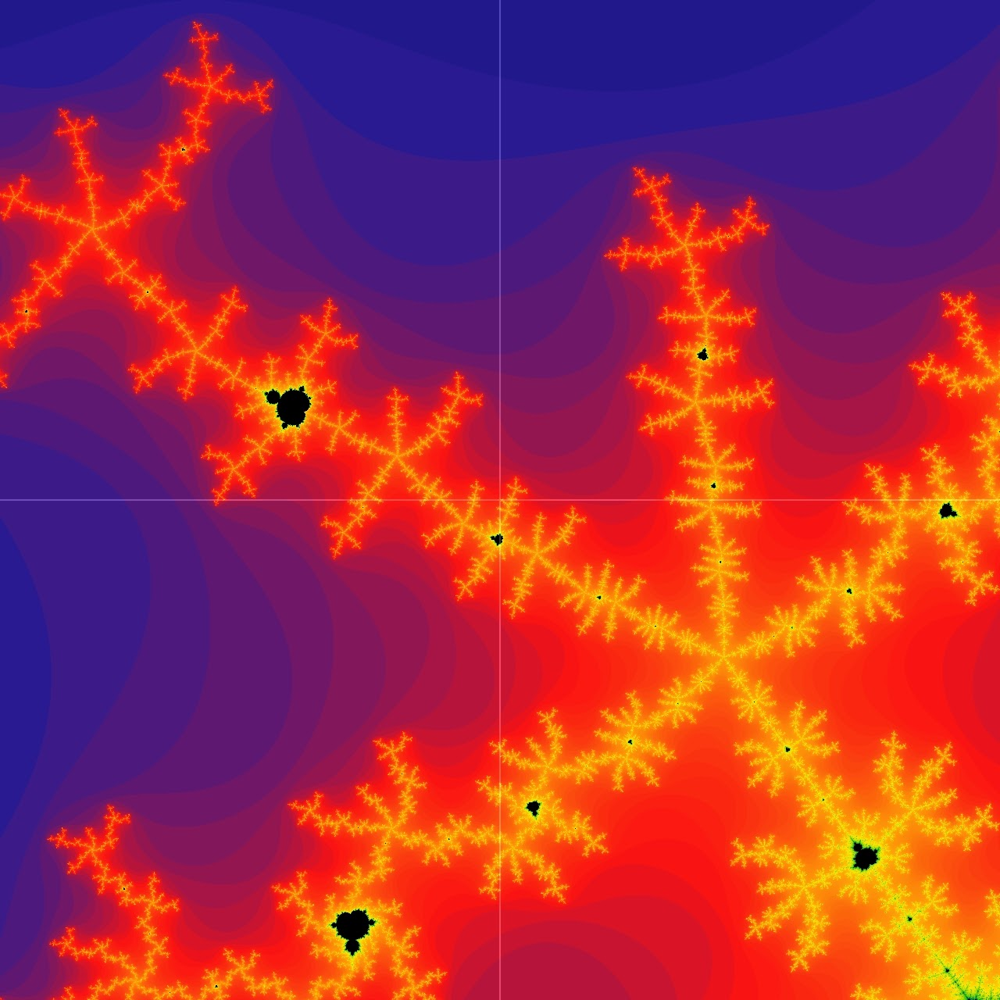

# Freaky Fractals

<-Mandelbrot Set
<-Freaky

<-Mandelbrot Set
<-Trippy

<-Mandelbrot Set
<-Woah

When I think of fractals, I think of a psychedelic trip. Even though I never experienced this feeling, it’s heavily featured in media as flashy colors and morphing/looping shapes.

Coding the Mandelbrot set in GLSL is the perfect set up for me to animate and make it look even trippier.

Thanks to TouchDesigner’s nodes, I can make them pulsate vibrantly.
